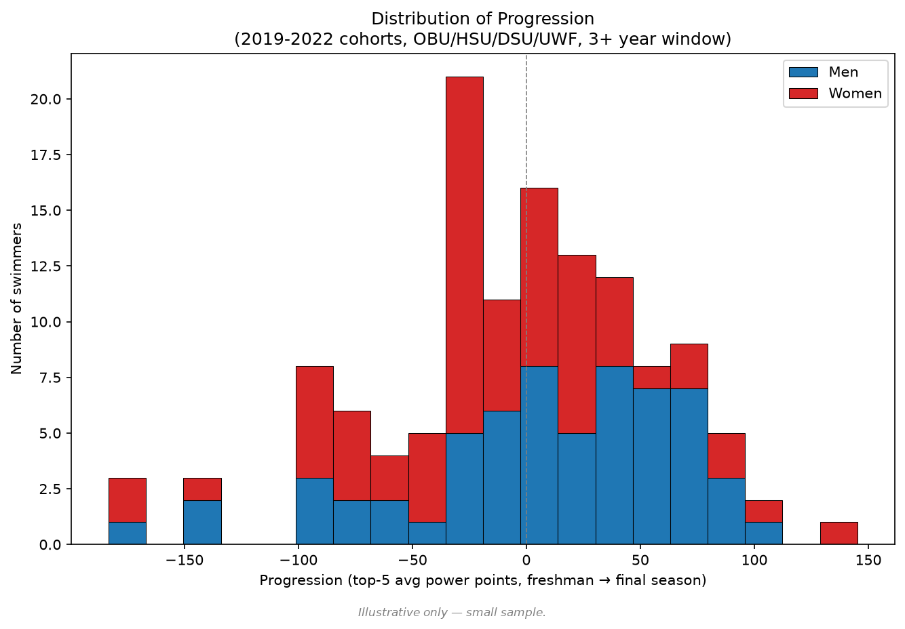
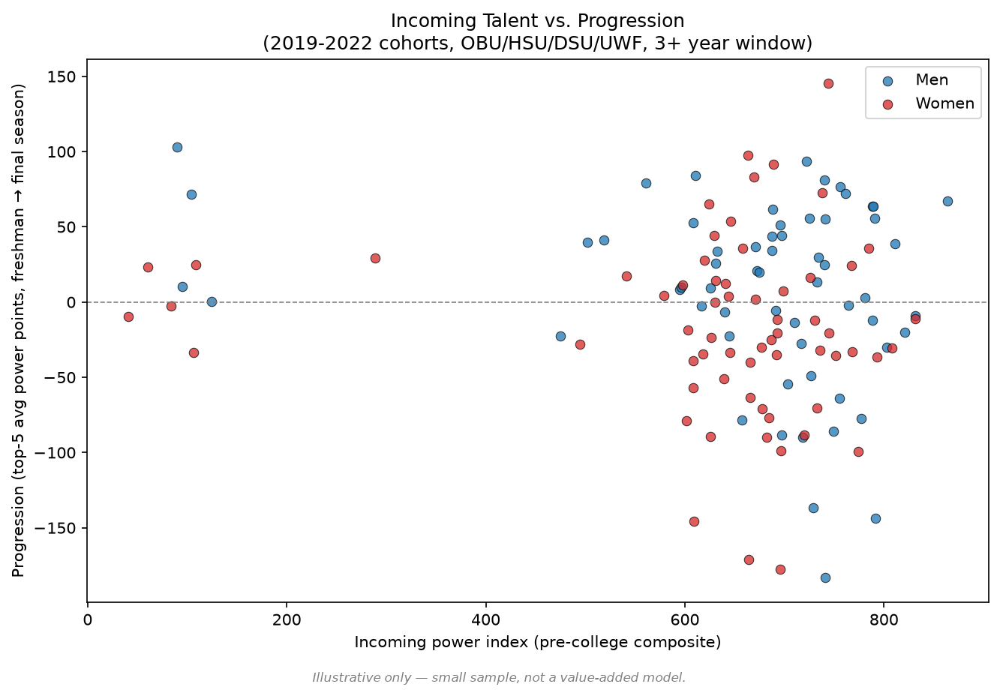
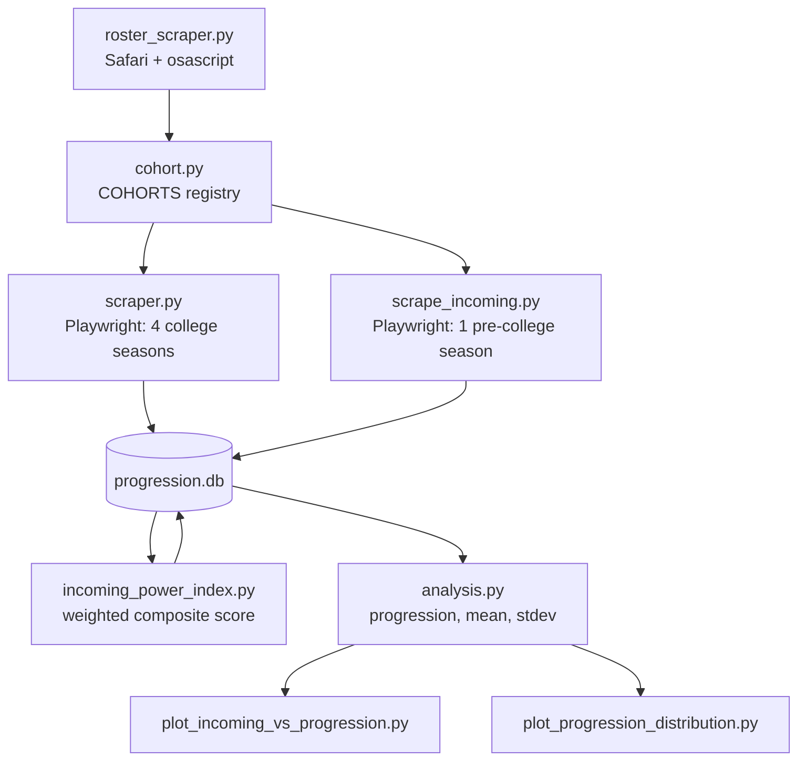

# D2 Swim Program Progression Analysis

**The question:** which NCAA Division II swim program, on average, produces the best *progression* in its swimmers over a four-year career? At the 2026 D2 Championships, I watched a swimmer go from an unremarkable recruit to a multi-event national record holder over four years, and his teammates showed a milder version of the same trajectory. That pattern (individual + teammates) points toward a program effect, not just individual development. No published study addresses this question for any NCAA division.

**This is a proof of concept, not a finding.** It's scoped to three conference programs I could verify by hand: Ouachita Baptist, Henderson State, and Delta State, plus the University of West Florida across the 2019–2022 entering classes. The pipeline works end to end and the methodology is sound, but the sample (7 team/gender groups, 12–27 swimmers each) is too small to rank anything. SwimCloud has since asked that scraping stop, so this dataset is final. See [REPORT.md](REPORT.md) for the full write-up, every design decision, and complete results.

## Tech Stack

- **Python** — primary language for the full pipeline: scraping, database management, and analysis.
- **SQLite (via sqlite3)** — lightweight relational database used to store swimmer and times data. Chosen because the dataset is small, and does not require a server.
- **Playwright (Firefox)** — browser automation library used to scrape times data from SwimCloud's API. Required because SwimCloud is protected by Cloudflare, which blocks standard HTTP clients.
- **BeautifulSoup** — HTML parsing for roster pages.
- **osascript (Safari)** — Apple's scripting interface, used to pull roster HTML directly from an active Safari tab, since even Playwright was blocked by Cloudflare Turnstile on those pages.
- **matplotlib** — static charts (progression distribution, incoming talent vs. progression) for this README.

## Key Findings

**Overall progression, all cohorts combined** (change in top-5-avg SCY power points, freshman → final qualifying season):

| Team | Gender | n | Mean | Stdev |
|---|---|---|---|---|
| OBU | Men | 27 | +17.5 pts | 63.5 |
| OBU | Women | 18 | -17.2 pts | 38.1 |
| HSU | Men | 20 | +2.1 pts | 60.5 |
| HSU | Women | 12 | -22.3 pts | 63.6 |
| DSU | Men | 14 | -0.6 pts | 58.3 |
| DSU | Women | 17 | -20.3 pts | 66.1 |
| UWF | Women | 19 | -8.9 pts | 69.4 |

Every group's standard deviation is roughly **3–4x its mean** — individual variability dwarfs the average signal. That's not a caveat tacked onto the results, it's the headline: at this sample size, a mean alone would be misleading, which is exactly why this project doesn't rank programs.



To start pulling apart incoming talent from actual improvement, each swimmer's pre-college best times were used to build a weighted composite score (see [REPORT.md](REPORT.md#incoming-talent-proxy-power-index) for why this isn't SwimCloud's literal Power Index). Plotting it against progression:



A small cluster of swimmers sits well below the main mass on incoming talent — spot-checked by hand against SwimCloud and confirmed genuine, not a scraping artifact: some swimmers really do enter with a thin, weak pre-college record.

## Technical Challenges

- **Cloudflare blocked standard HTTP clients.** `requests` worked until Cloudflare started returning 403s by fingerprinting the client. Fixed by switching times-scraping to Playwright with a real Firefox instance and a persistent browser context.
- **Even Playwright got blocked on roster pages.** Cloudflare Turnstile stopped Playwright specifically on HTML roster pages. Fixed by pulling roster HTML directly from an active Safari tab via `osascript` — a real, unautomated browser passes natively.
- **SwimCloud's recruiting score (Power Index) isn't public data.** It disappears from a profile once a swimmer enrolls in college, and SwimCloud only documents part of its formula (the event-weighting, not the final percentile normalization). Rather than guess at the missing piece, this project built its own weighted composite from the documented part of the formula and stopped there — see [REPORT.md](REPORT.md#incoming-talent-proxy-power-index).
- **Respecting the scraping boundary.** After SwimCloud explicitly asked for scraping to stop, remaining data gaps (12 of 202 swimmers missing pre-college data) were left as a disclosed limitation rather than chased with more automated requests.

## Architecture



## Engineering Methodology

- **Power points, not raw times** — a standardized scoring system so a 100 free and a 400 IM can be compared on one scale.
- **Season-best times** — each season's score comes from a swimmer's fastest time per event that season, so freshman and senior scores are both drawn from tapered, peak-performance conditions.
- **SCY-locked for the progression metric** (non-SCY swims dropped), but **all courses allowed for the incoming-talent proxy** — a deliberate, disclosed exception, since pre-college club seasons are frequently SCM/LCM-only.
- **Raw improvement, not value-added** — no baseline model is fit (not enough data), so incoming talent confounding is disclosed rather than corrected for.
- **`INSERT OR IGNORE` everywhere** — every scraper is safely rerunnable without duplicating data.

Full reasoning for each decision, including the ones with real tradeoffs, is in [REPORT.md](REPORT.md#key-design-decisions).

## Limitations

- **Incoming talent confounding** — raw improvement conflates coaching quality with recruiting strength; no value-added model is fit.
- **Incoming talent proxy ≠ SwimCloud's Power Index** — replicates the documented event-weighting, not the undocumented percentile normalization.
- **12 of 202 swimmers (6%) missing pre-college data** — not aggressively chased, to avoid further automated requests after SwimCloud's warning.
- **Event portfolio sensitivity** — a swimmer's score can shift from changing which events they swim, not just performance.
- **Transfer freshmen missed** — the roster scraper only catches swimmers listed as "FR," missing transfers-in.
- **COVID cohort sparsity** — 2019/2020 cohorts have high exclusion rates and survivorship bias.
- **Mixed progression windows** — overall means combine 4-year and 3-year windows, which aren't directly equivalent.
- **Small samples, with the variance to prove it** — stdev is routinely 3–4x the mean; do not rank programs from this data.

Full detail on every limitation is in [REPORT.md](REPORT.md#limitations).

## How to Run

The database (`progression.db`) is included in the repository, so scraping is not required. To reproduce the analysis and charts:

```bash
git clone https://github.com/ianredmann/d2_swim_program_progression_analysis.git
cd d2_swim_program_progression_analysis
python3 -m venv .venv
source .venv/bin/activate
pip install playwright beautifulsoup4 matplotlib
python3 analysis.py
python3 plot_progression_distribution.py
python3 plot_incoming_vs_progression.py
```

Note: the scraping scripts (`scraper.py`, `scrape_incoming.py`, `roster_scraper.py`) require a live, logged-in SwimCloud session and Playwright's browser binaries (`playwright install firefox`), and are not reproducible without one. The dataset is final — see [REPORT.md](REPORT.md#what-it-would-take-to-do-this-properly) for why.
